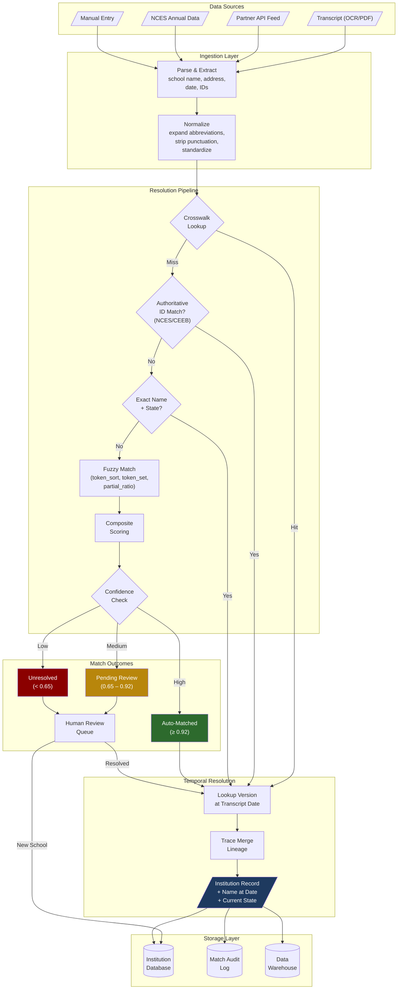

# Data Flow Diagram

## How Transcript Data Flows to an Institution Record

## Flow Description

| Step | Description |
|------|------------|
| **Parse & Extract** | Raw data from transcripts, partner feeds, or manual entry is parsed to extract school name, address, dates, and any identifiers. |
| **Normalize** | Abbreviations expanded, punctuation removed, case standardized. This is critical for both exact and fuzzy matching. |
| **Crosswalk Lookup** | Check if this partner + school ID combination has been seen before. If yes, we have a direct mapping. |
| **Authoritative ID Match** | Check NCES ID or CEEB code for an exact match. These are high-confidence signals. |
| **Exact Name + State** | Normalized name + state is checked for an exact match against our database. |
| **Fuzzy Match** | Multiple fuzzy strategies (token_sort, token_set, partial_ratio) are combined with address and geographic signals. |
| **Composite Scoring** | Weighted combination: 55% name, 20% address, 15% state, 10% zip. |
| **Classification** | Auto-accept (≥0.92), pending review (0.65–0.92), or unresolved (<0.65). |
| **Temporal Resolution** | Once matched, find the `institution_version` active at the transcript date and trace any merge lineage. |
