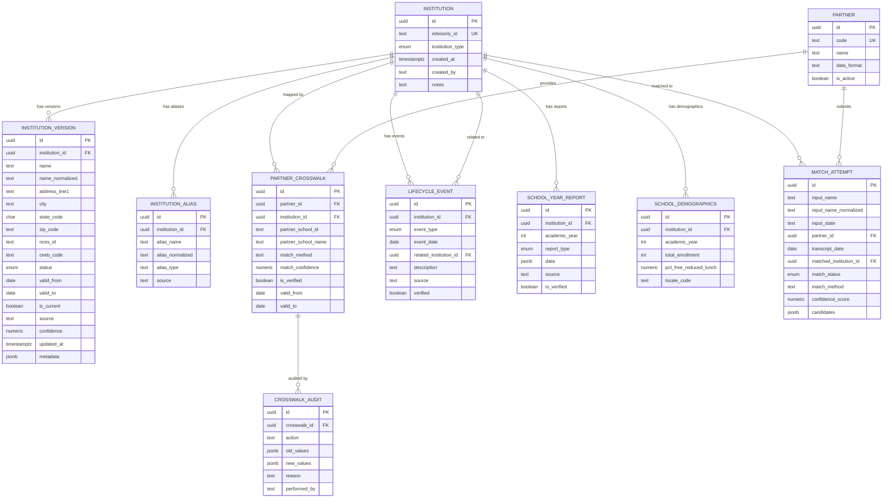

# Entity-Relationship Diagram

## Core Data Model

## Key Design Notes

1. **INSTITUTION** is the stable identity anchor — it never changes, only accumulates versions.
2. **INSTITUTION_VERSION** uses SCD Type 2 with `[valid_from, valid_to)` windows. `valid_to = NULL` means current.
3. **LIFECYCLE_EVENT** links institutions through merges/renames via `related_institution_id`.
4. **PARTNER_CROSSWALK** maps each partner's identifier to our canonical record, with confidence and verification tracking.
5. **MATCH_ATTEMPT** logs every matching attempt for auditability and model improvement.
