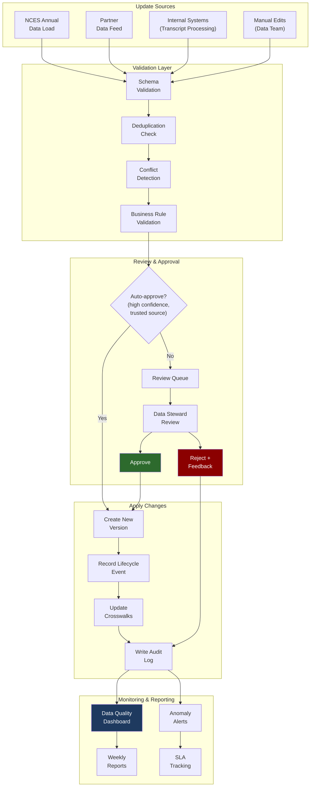
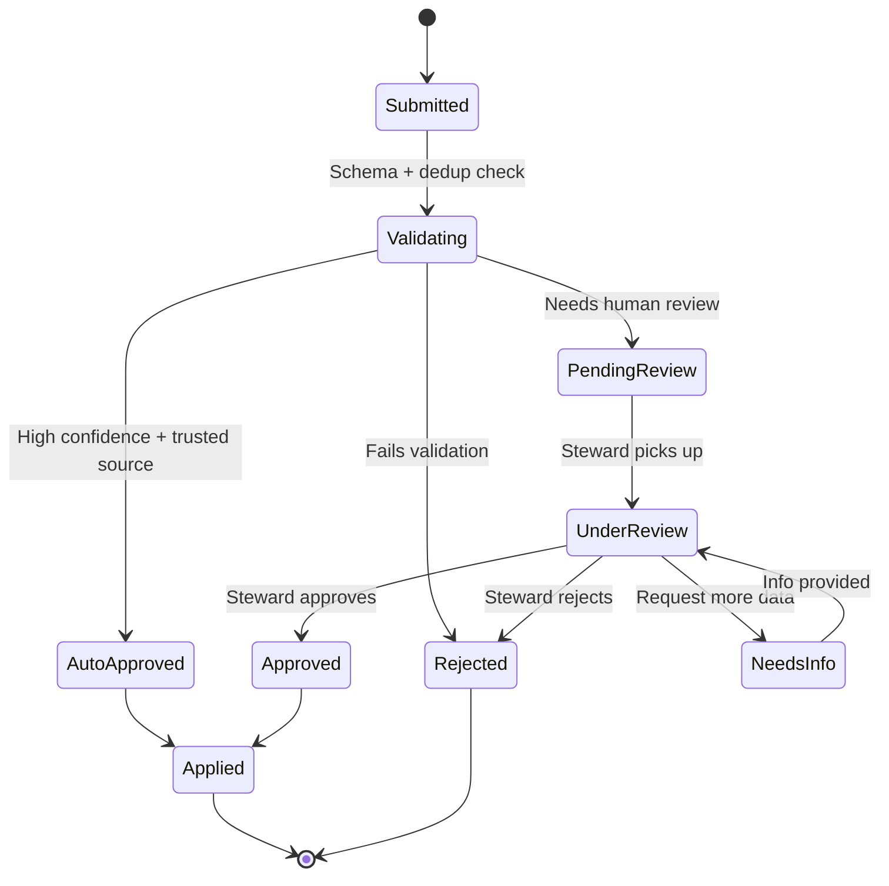
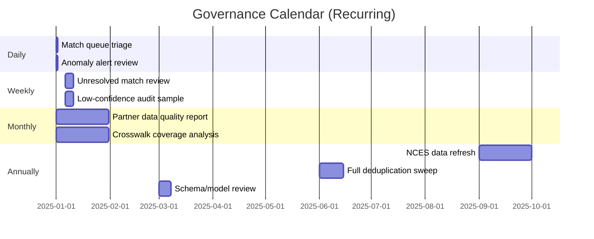

# Governance and Review Process

## Data Governance Architecture

```mermaid
flowchart TD
    subgraph Sources["Update Sources"]
        NCES["NCES Annual<br/>Data Load"]
        PARTNER["Partner<br/>Data Feed"]
        INTERNAL["Internal Systems<br/>(Transcript Processing)"]
        MANUAL["Manual Edits<br/>(Data Team)"]
    end

    subgraph Validation["Validation Layer"]
        SCHEMA["Schema<br/>Validation"]
        DEDUP["Deduplication<br/>Check"]
        CONFLICT["Conflict<br/>Detection"]
        BUSINESS["Business Rule<br/>Validation"]
    end

    subgraph Review["Review & Approval"]
        AUTO_APPROVE{"Auto-approve?<br/>(high confidence,<br/>trusted source)"}
        QUEUE["Review Queue"]
        REVIEWER["Data Steward<br/>Review"]
        APPROVE["Approve"]
        REJECT["Reject +<br/>Feedback"]
    end

    subgraph Apply["Apply Changes"]
        VERSION["Create New<br/>Version"]
        LIFECYCLE["Record Lifecycle<br/>Event"]
        CROSSWALK_UPDATE["Update<br/>Crosswalks"]
        AUDIT_LOG["Write Audit<br/>Log"]
    end

    subgraph Monitor["Monitoring & Reporting"]
        DASHBOARD["Data Quality<br/>Dashboard"]
        ALERTS["Anomaly<br/>Alerts"]
        REPORTS["Weekly<br/>Reports"]
        SLA["SLA<br/>Tracking"]
    end

    NCES --> SCHEMA
    PARTNER --> SCHEMA
    INTERNAL --> SCHEMA
    MANUAL --> SCHEMA

    SCHEMA --> DEDUP
    DEDUP --> CONFLICT
    CONFLICT --> BUSINESS
    BUSINESS --> AUTO_APPROVE

    AUTO_APPROVE -->|Yes| VERSION
    AUTO_APPROVE -->|No| QUEUE
    QUEUE --> REVIEWER
    REVIEWER --> APPROVE
    REVIEWER --> REJECT
    APPROVE --> VERSION
    REJECT --> AUDIT_LOG

    VERSION --> LIFECYCLE
    LIFECYCLE --> CROSSWALK_UPDATE
    CROSSWALK_UPDATE --> AUDIT_LOG

    AUDIT_LOG --> DASHBOARD
    AUDIT_LOG --> ALERTS
    DASHBOARD --> REPORTS
    ALERTS --> SLA

    style APPROVE fill:#2d6a2d,color:#fff
    style REJECT fill:#8b0000,color:#fff
    style DASHBOARD fill:#1e3a5f,color:#fff
```

## Review Queue Lifecycle

```mermaid
stateDiagram-v2
    [*] --> Submitted
    Submitted --> Validating : Schema + dedup check
    Validating --> AutoApproved : High confidence + trusted source
    Validating --> PendingReview : Needs human review
    Validating --> Rejected : Fails validation

    PendingReview --> UnderReview : Steward picks up
    UnderReview --> Approved : Steward approves
    UnderReview --> NeedsInfo : Request more data
    UnderReview --> Rejected : Steward rejects
    NeedsInfo --> UnderReview : Info provided

    AutoApproved --> Applied
    Approved --> Applied
    Applied --> [*]
    Rejected --> [*]
```

## Scheduled Governance Processes

```mermaid
gantt
    title Governance Calendar (Recurring)
    dateFormat  YYYY-MM-DD
    section Daily
    Match queue triage           :daily1, 2025-01-01, 1d
    Anomaly alert review         :daily2, 2025-01-01, 1d
    section Weekly
    Unresolved match review      :weekly1, 2025-01-06, 5d
    Low-confidence audit sample  :weekly2, 2025-01-06, 5d
    section Monthly
    Partner data quality report  :monthly1, 2025-01-01, 30d
    Crosswalk coverage analysis  :monthly2, 2025-01-01, 30d
    section Annually
    NCES data refresh            :annual1, 2025-09-01, 30d
    Full deduplication sweep     :annual2, 2025-06-01, 14d
    Schema/model review          :annual3, 2025-03-01, 7d
```
