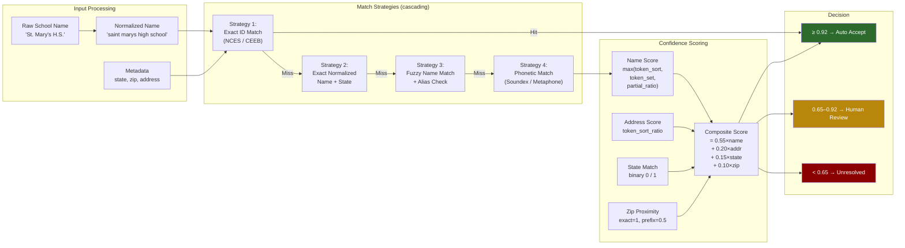
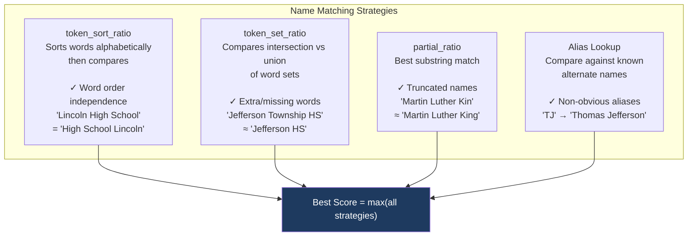

# Matching Pipeline Detail

## Multi-Strategy Matching Architecture

## Fuzzy Matching Strategies Compared

## Confidence Score Breakdown Example

| Signal | Weight | Example Value | Contribution |
|--------|--------|---------------|-------------|
| Name similarity | 0.55 | 0.88 | 0.484 |
| Address similarity | 0.20 | 0.72 | 0.144 |
| State match | 0.15 | 1.00 (yes) | 0.150 |
| Zip proximity | 0.10 | 1.00 (exact) | 0.100 |
| **Composite** | | | **0.878** |
| **Decision** | | | **Pending Review** (0.65 ≤ 0.878 < 0.92) |
