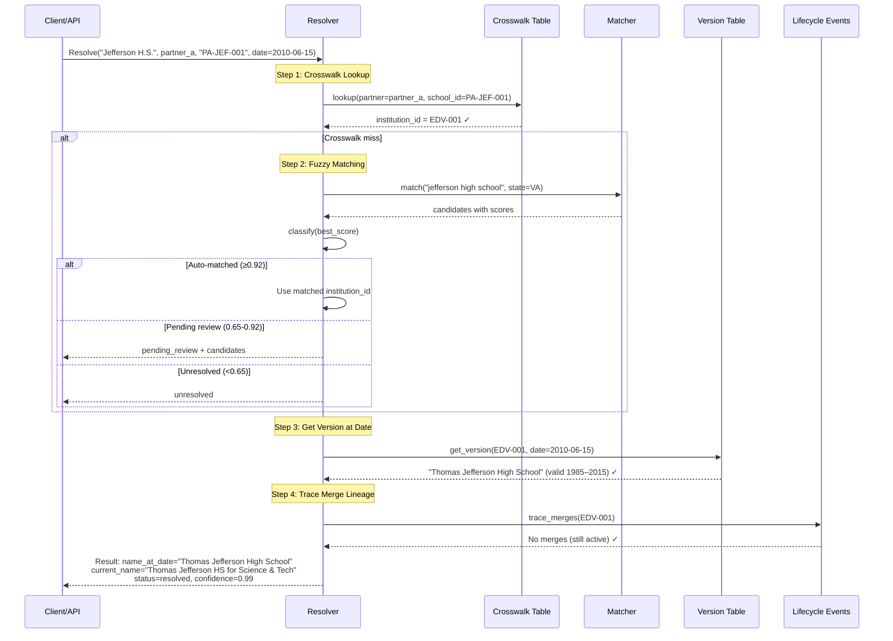
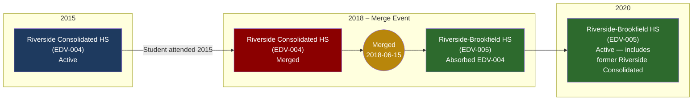

# Temporal Resolution: "School at Date X"

## How We Answer "What was this school when the student attended?"

## Merge Lineage Tracing Example

### Resolution for a 2015 Transcript from Riverside Consolidated:

| Field | Value |
|-------|-------|
| **Input** | "Riverside Consolidated H.S.", transcript date = 2015-06-01 |
| **Matched Institution** | EDV-004 (Riverside Consolidated High School) |
| **Name at Date** | "Riverside Consolidated High School" (active version 1970–2018) |
| **Current Successor** | EDV-005 (Riverside-Brookfield High School) |
| **Merge Lineage** | EDV-004 → EDV-005 |
| **Note** | School reports for 2015 should be pulled from EDV-004; current-year reports from EDV-005 |
